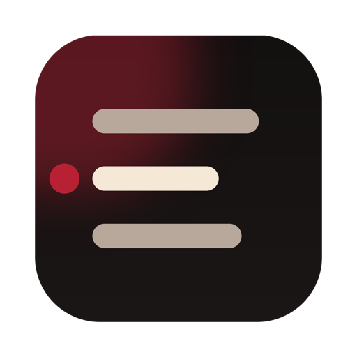
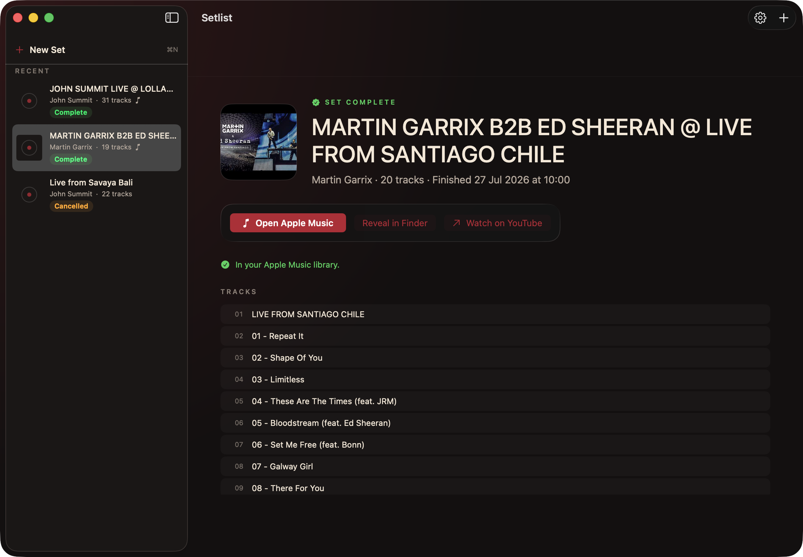
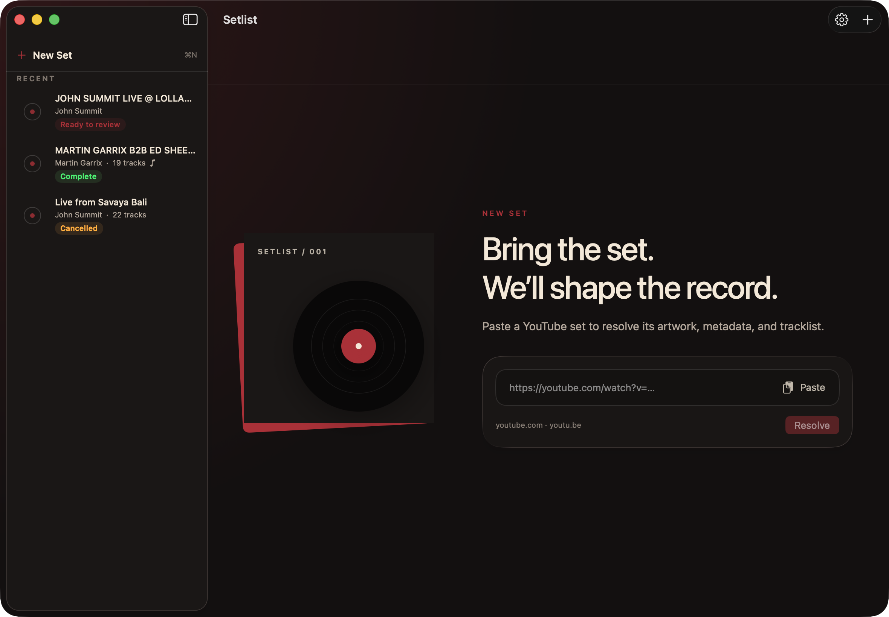

<div>
<h3>Setlist</h3>
<p>Turns a YouTube DJ set or concert into a tagged, gapless album in Apple Music.
Paste a link, review the tracklist, click Download — everything runs on your own Mac.</p>
<a href="https://github.com/JanOstrowka/setlist/releases/latest"></a>
</div>

<br/><br/>

<div align="center">
<a href="https://github.com/JanOstrowka/setlist/releases"></a>
<a href="https://github.com/JanOstrowka/setlist/releases"></a>
<a href="https://github.com/JanOstrowka/setlist/blob/main/LICENSE"></a>
<a href="https://github.com/JanOstrowka/setlist"></a>

<br/>
<br/>

<br/>

</div>

<hr>

## Download

Go to [Releases](https://github.com/JanOstrowka/setlist/releases) and download the latest `.dmg`.
Everything the app needs — the media engine, `ffmpeg`, `yt-dlp` — ships inside it. There is nothing else to install.

## Major features

- Paste a YouTube URL and get a finished album: best-quality audio, encoded to Apple-Music-native **ALAC** (or AAC 256), tagged, with a square cover.
- Finds the tracklist for you — YouTube chapters, description timestamps, or 1001tracklists — and cuts the set into per-track files **losslessly** at the cue points.
- Review before anything is written: edit title, artist, album, year, genre, and every cue; preview any cue in the embedded player.
- Change your mind later: **Edit Set** on any finished set fixes titles or cues and replaces the files — the encoded master is cached, so a re-run skips the download.
- **Add to Apple Music** in one click when the set is done; files import as a single gapless album.
- Remembers every set in a **Recent** sidebar; one set is produced at a time, with live download speed, ETA and per-track status.
- **No account, no API key.** Nothing to sign up for or paste in; the app is complete as downloaded.
- Runs from the menu bar. Nothing leaves your Mac except the requests to YouTube and 1001tracklists.
- Completely free and open source.

### Screenshots

<div align="center">

</div>

## How to install and use the app

1. [Download the app](https://github.com/JanOstrowka/setlist/releases/latest) and open the `.dmg`.
2. Drag **Setlist** into your **Applications** folder.
3. Open it. macOS will say it "could not verify" the app, because Setlist is a free project without an Apple Developer ID. Click **Done**, then go to **System Settings » Privacy & Security**, scroll down and click **Open Anyway** (or right-click the app » **Open**). You only do this once.
4. Paste a YouTube URL and click **Resolve**.
5. Check the metadata and tracklist, then click **Download**.
6. When it's done, click **Add to Apple Music**. The first time, macOS asks whether Setlist may control Music — that permission is what performs the import.
7. Spotted a wrong title afterwards? Pick the set in **Recent**, click **Edit Set**, fix it, then **Replace Files**. Old files go to the Trash, never straight to deletion.
8. Open **Settings…** (`⌘,`) to pick the output folder (default `~/Music/YouTube Sets`) or switch to AAC. That's all there is to configure.

### macOS compatibility

| Setlist version | macOS version                     |
| --------------- | --------------------------------- |
| v0.1.0 – v0.1.1 | Tahoe 26 or newer, Apple Silicon  |

### A note on YouTube

Setlist downloads audio from YouTube on your Mac for your own library, the same way `yt-dlp` does. Whether that's allowed for a given video depends on your local law and the rights of the video's owner. The app is a tool; how you use it is up to you.

## Contributing to the project

Issues and pull requests are welcome. Before a large change, open an issue first so we can talk it through.

## How to build

### Required

- Xcode 27 / Swift 6.2
- [uv](https://docs.astral.sh/uv/) (`brew install uv`) — fetches the CPython that gets bundled
- Python 3.11+ and `ffmpeg` only if you want to run the engine from source (`./run.sh`)

### Build steps

```sh
git clone https://github.com/JanOstrowka/setlist.git
cd setlist
./scripts/build_macos_app.sh    # → dist/Setlist.app
./scripts/build_dmg.sh          # → dist/Setlist-<version>-arm64.dmg
```

The build bundles a relocatable Python, the backend, and static `ffmpeg`/`ffprobe` into the `.app` and signs it ad-hoc. Configuration keys, the web UI, tests, and the output layout are described in [docs/development.md](docs/development.md).

### Third party dependencies

- [yt-dlp](https://github.com/yt-dlp/yt-dlp) — download
- [FFmpeg](https://ffmpeg.org) — encode, split, cover art; static macOS builds by [Martin Riedl](https://ffmpeg.martin-riedl.de)
- [mutagen](https://github.com/quodlibet/mutagen) — MP4 tagging
- [FastAPI](https://fastapi.tiangolo.com) + [uvicorn](https://www.uvicorn.org) — the local engine API
- [Pillow](https://python-pillow.org), [httpx](https://www.python-httpx.org), [pydantic](https://docs.pydantic.dev), [python-dotenv](https://github.com/theskumar/python-dotenv)
- [python-build-standalone](https://github.com/astral-sh/python-build-standalone) via `uv` — the bundled interpreter

## Credits

- [@JanOstrowka](https://github.com/JanOstrowka) — author
- README layout borrowed from [MonitorControl](https://github.com/MonitorControl/MonitorControl)
